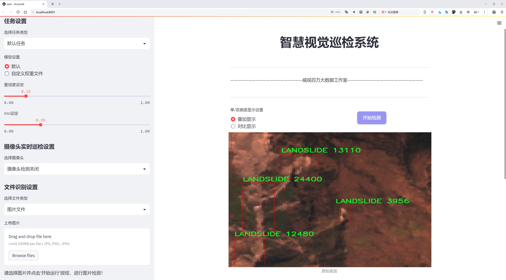
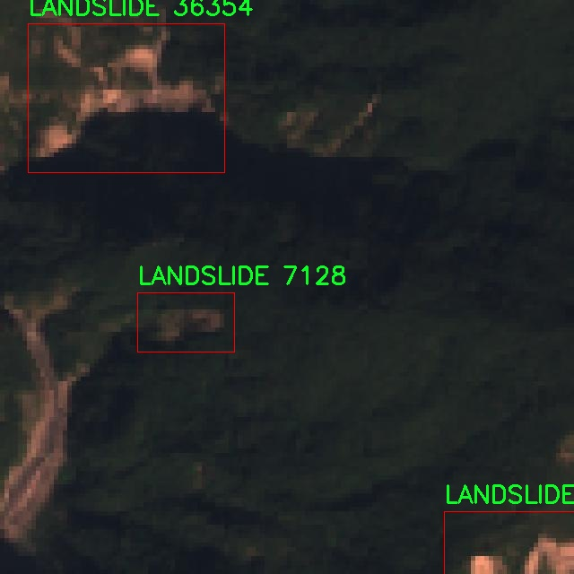

# 山体滑坡检测检测系统源码分享
 # [一条龙教学YOLOV8标注好的数据集一键训练_70+全套改进创新点发刊_Web前端展示]

### 1.研究背景与意义

项目参考[AAAI Association for the Advancement of Artificial Intelligence](https://gitee.com/qunshansj/projects)

项目来源[AACV Association for the Advancement of Computer Vision](https://gitee.com/qunmasj/projects)

研究背景与意义

山体滑坡作为一种常见的地质灾害，给人类的生命财产安全带来了严重威胁。根据统计数据，全球每年因山体滑坡造成的损失高达数十亿美元，尤其在多雨季节和地震频发地区，滑坡事件的发生频率显著增加。传统的山体滑坡监测方法主要依赖于人工巡查和地质专家的判断，这不仅耗时耗力，而且在面对大面积山区时，难以实现全面、及时的监测。因此，开发高效、准确的山体滑坡检测系统显得尤为重要。

近年来，随着深度学习技术的迅猛发展，基于计算机视觉的目标检测方法逐渐成为地质灾害监测的研究热点。YOLO（You Only Look Once）系列模型因其高效的实时检测能力和较好的检测精度，广泛应用于各种目标检测任务。YOLOv8作为该系列的最新版本，结合了更先进的网络结构和优化算法，能够在复杂环境中实现更高的检测性能。然而，针对特定应用场景的改进仍然是提升模型效果的关键。针对山体滑坡这一特定类别的检测，改进YOLOv8模型，能够更好地适应滑坡特征的多样性和复杂性，从而提高检测的准确性和可靠性。

本研究所使用的数据集包含1600幅图像，专注于山体滑坡这一单一类别。这一数据集的构建为模型的训练和验证提供了坚实的基础。通过对图像数据的深入分析，我们可以提取出山体滑坡的特征信息，包括滑坡的形态、颜色变化及其与周围环境的关系等。这些特征不仅有助于提高模型的学习能力，也为后续的模型优化提供了重要依据。此外，数据集的规模虽然相对较小，但通过数据增强技术，可以有效扩展训练样本的多样性，从而提升模型的泛化能力。

本研究的意义在于，通过改进YOLOv8模型，构建一个高效的山体滑坡检测系统，能够实现对滑坡事件的实时监测与预警。这不仅有助于提升滑坡灾害的响应速度，减少潜在的损失，还能为相关部门提供科学依据，优化灾害管理与应急响应策略。同时，研究成果将为其他地质灾害的监测提供借鉴，推动计算机视觉技术在地质工程领域的应用发展。

综上所述，基于改进YOLOv8的山体滑坡检测系统的研究，不仅具有重要的理论价值，也具备显著的实际应用意义。通过这一研究，我们期望能够为山体滑坡的监测与防治提供一种新的技术手段，为保护人民生命财产安全贡献力量。

### 2.图片演示





##### 注意：由于此博客编辑较早，上面“2.图片演示”和“3.视频演示”展示的系统图片或者视频可能为老版本，新版本在老版本的基础上升级如下：（实际效果以升级的新版本为准）

  （1）适配了YOLOV8的“目标检测”模型和“实例分割”模型，通过加载相应的权重（.pt）文件即可自适应加载模型。

  （2）支持“图片识别”、“视频识别”、“摄像头实时识别”三种识别模式。

  （3）支持“图片识别”、“视频识别”、“摄像头实时识别”三种识别结果保存导出，解决手动导出（容易卡顿出现爆内存）存在的问题，识别完自动保存结果并导出到tempDir中。

  （4）支持Web前端系统中的标题、背景图等自定义修改，后面提供修改教程。

  另外本项目提供训练的数据集和训练教程,暂不提供权重文件（best.pt）,需要您按照教程进行训练后实现图片演示和Web前端界面演示的效果。

### 3.视频演示

[3.1 视频演示](https://www.bilibili.com/video/BV1dGtJeCEiZ/)

### 4.数据集信息展示

##### 4.1 本项目数据集详细数据（类别数＆类别名）

nc: 1
names: ['LANDSLIDE']


##### 4.2 本项目数据集信息介绍

数据集信息展示

在进行山体滑坡检测系统的研究与开发过程中，数据集的选择与构建至关重要。本项目所采用的数据集名为“LANDSLIDE DETECTION”，其专注于山体滑坡现象的识别与分类，旨在为改进YOLOv8模型提供高质量的训练数据。该数据集的设计充分考虑了山体滑坡的多样性与复杂性，确保模型在实际应用中具备良好的泛化能力。

“LANDSLIDE DETECTION”数据集的类别数量为1，具体类别为“LANDSLIDE”。这一单一类别的设定反映了研究的专一性，旨在深入挖掘山体滑坡的特征与模式。尽管类别数量有限，但数据集中的样本涵盖了多种不同类型的山体滑坡情况，包括但不限于泥石流、崩塌、滑坡等现象。这种多样性使得模型能够学习到不同环境下山体滑坡的表现形式，从而提高检测的准确性和鲁棒性。

数据集的构建过程中，研究团队收集了来自不同地理区域和气候条件下的山体滑坡图像，确保了数据的多样性和代表性。这些图像不仅包括了不同规模的滑坡事件，还涵盖了不同的地形特征，如山脊、坡面和河谷等。通过这种方式，数据集能够更全面地反映山体滑坡的发生机制与环境影响，为后续的模型训练提供了丰富的样本基础。

在数据标注方面，所有图像均经过专业人员的仔细审核与标注，确保每个样本的准确性和一致性。标注过程中，研究团队采用了先进的图像标注工具，确保滑坡区域的边界清晰可辨。这一过程不仅提高了数据集的质量，也为模型的训练提供了可靠的监督信号，使得YOLOv8能够在学习过程中有效地识别出滑坡的特征。

此外，为了增强模型的训练效果，数据集还进行了多种数据增强处理，如旋转、缩放、翻转和颜色调整等。这些增强技术的应用，不仅增加了数据集的样本数量，也提升了模型的鲁棒性，使其能够更好地适应不同的输入条件和环境变化。

总之，“LANDSLIDE DETECTION”数据集的构建充分考虑了山体滑坡检测的实际需求，旨在为改进YOLOv8模型提供坚实的数据基础。通过对数据集的精心设计与多样化处理，研究团队期望能够提升模型在山体滑坡检测中的性能，进而为自然灾害的预警与防范提供有效的技术支持。随着研究的深入，数据集的不断优化与扩展也将为未来的研究提供更多可能性，推动山体滑坡检测技术的进一步发展。




### 5.全套项目环境部署视频教程（零基础手把手教学）

[5.1 环境部署教程链接（零基础手把手教学）](https://www.ixigua.com/7404473917358506534?logTag=c807d0cbc21c0ef59de5)


[5.2 安装Python虚拟环境创建和依赖库安装视频教程链接（零基础手把手教学）](https://www.ixigua.com/7404474678003106304?logTag=1f1041108cd1f708b01a)

### 6.手把手YOLOV8训练视频教程（零基础小白有手就能学会）

[6.1 手把手YOLOV8训练视频教程（零基础小白有手就能学会）](https://www.ixigua.com/7404477157818401292?logTag=d31a2dfd1983c9668658)

### 7.70+种全套YOLOV8创新点代码加载调参视频教程（一键加载写好的改进模型的配置文件）

[7.1 70+种全套YOLOV8创新点代码加载调参视频教程（一键加载写好的改进模型的配置文件）](https://www.ixigua.com/7404478314661806627?logTag=29066f8288e3f4eea3a4)

### 8.70+种全套YOLOV8创新点原理讲解（非科班也可以轻松写刊发刊，V10版本正在科研待更新）

由于篇幅限制，每个创新点的具体原理讲解就不一一展开，具体见下列网址中的创新点对应子项目的技术原理博客网址【Blog】：


[8.1 70+种全套YOLOV8创新点原理讲解链接](https://gitee.com/qunmasj/good)

### 9.系统功能展示（检测对象为举例，实际内容以本项目数据集为准）

图9.1.系统支持检测结果表格显示

  图9.2.系统支持置信度和IOU阈值手动调节

  图9.3.系统支持自定义加载权重文件best.pt(需要你通过步骤5中训练获得)

  图9.4.系统支持摄像头实时识别

  图9.5.系统支持图片识别

  图9.6.系统支持视频识别

  图9.7.系统支持识别结果文件自动保存

  图9.8.系统支持Excel导出检测结果数据


### 10.原始YOLOV8算法原理

原始YOLOv8算法原理

YOLOv8算法是Ultralytics公司在2023年推出的一个重要版本，它在之前的YOLO系列算法的基础上进行了多项创新和改进，旨在提升目标检测、图像分割和图像分类等任务的性能。YOLOv8的设计理念强调快速、准确和易于使用，使其成为当前计算机视觉领域的一个重要工具。

YOLOv8的网络结构由三个主要部分组成：Backbone、Neck和Head。Backbone负责特征提取，Neck负责特征融合，而Head则负责最终的检测输出。相较于前几代YOLO算法，YOLOv8在每个部分都进行了优化，以提高整体性能。

在输入层，YOLOv8默认接受640x640像素的图像作为输入，但在实际应用中，图像的长宽比往往各不相同。为了解决这一问题，YOLOv8采用自适应图片缩放技术。在测试或推理阶段，算法会将图像的长边按比例缩小到640像素，然后对短边进行填充，以尽量减少信息冗余。这种方法不仅提高了目标检测的速度，还确保了模型在处理不同尺寸图像时的灵活性。此外，在训练阶段，YOLOv8引入了Mosaic图像增强技术。该技术通过随机选择四张图像并进行缩放和拼接，生成新的训练样本，从而迫使模型学习到不同位置和周围像素的变化。这种数据增强方法有效提高了模型的预测精度和鲁棒性。

在Backbone部分，YOLOv8的设计借鉴了YOLOv7中的ELAN模块，采用了C2F模块替代了YOLOv5中的C3模块。C3模块通过CSPNet的分流思想来提取特征，而C2F模块则通过并行更多的梯度流分支来增强特征提取的能力。这样的设计使得YOLOv8在保持轻量化的同时，能够获得更丰富的梯度信息，从而提高了模型的精度和效率。

Neck部分的改进同样显著。YOLOv8在这一部分去除了YOLOv5中两次上采样前的1x1卷积连接层，直接对Backbone不同阶段输出的特征进行上采样。这种简化的结构使得特征融合更加高效，减少了计算复杂度，同时保持了特征信息的完整性。

在Head部分，YOLOv8的变化尤为显著。它从Coupled-Head（耦合头）转变为Decoupled-Head（解耦头），将检测和分类的卷积操作分开处理。具体而言，输入的特征图首先通过两个1x1的卷积模块进行降维，然后分别用于类别预测和边界框位置及IoU（交并比）预测。这种解耦设计不仅提高了模型的灵活性，还减少了不同任务之间的干扰，从而提升了整体性能。

值得注意的是，YOLOv8摒弃了以往的Anchor-Based（基于锚框）方法，转而采用Anchor-Free（无锚框）的方法。传统的Anchor-Based方法依赖于预设的锚框来进行目标检测，这虽然在一定程度上提高了模型的准确性，但也增加了计算复杂度，并且在处理不同尺度和长宽比的目标时缺乏灵活性。YOLOv8通过将目标检测转化为关键点检测，避免了对锚框的依赖，从而简化了网络结构，增强了模型的泛化能力。

在损失函数的设计上，YOLOv8也进行了创新。它取消了Obj分支，直接在分类分支中使用二值交叉熵损失（BCELoss），而在边界框回归分支中则采用了分布焦点损失（DFL）和CIoU损失。这种设计旨在使网络模型能够快速聚焦于标签附近的数值，从而提高目标检测的精度。

总的来说，YOLOv8通过一系列的结构优化和算法改进，显著提升了目标检测的速度和精度。它不仅在各类数据集上表现出色，而且由于其灵活的设计，能够适应不同的应用场景，成为计算机视觉领域中一个极具竞争力的算法选择。随着YOLOv8的广泛应用，预计将会在自动驾驶、安防监控、智能家居等多个领域发挥重要作用。


### 11.项目核心源码讲解（再也不用担心看不懂代码逻辑）

#### 11.1 ui.py

以下是代码的核心部分，并附上详细的中文注释：

```python
import sys
import subprocess

def run_script(script_path):
    """
    使用当前 Python 环境运行指定的脚本。

    Args:
        script_path (str): 要运行的脚本路径

    Returns:
        None
    """
    # 获取当前 Python 解释器的路径
    python_path = sys.executable

    # 构建运行命令，使用 streamlit 运行指定的脚本
    command = f'"{python_path}" -m streamlit run "{script_path}"'

    # 执行命令
    result = subprocess.run(command, shell=True)
    
    # 检查命令执行的返回码，如果不为0，表示出错
    if result.returncode != 0:
        print("脚本运行出错。")

# 实例化并运行应用
if __name__ == "__main__":
    # 指定要运行的脚本路径
    script_path = "web.py"  # 这里可以直接指定脚本名

    # 调用函数运行脚本
    run_script(script_path)
```

### 代码分析：
1. **导入模块**：
   - `sys`：用于访问与 Python 解释器紧密相关的变量和函数。
   - `subprocess`：用于执行外部命令。

2. **函数 `run_script`**：
   - 参数 `script_path`：传入要运行的脚本路径。
   - 使用 `sys.executable` 获取当前 Python 解释器的路径，以确保使用正确的 Python 环境。
   - 构建命令字符串，使用 `streamlit` 模块运行指定的脚本。
   - 使用 `subprocess.run` 执行构建的命令，并检查返回码以判断脚本是否成功运行。

3. **主程序**：
   - 在 `if __name__ == "__main__":` 块中，指定要运行的脚本路径，并调用 `run_script` 函数执行该脚本。 

这段代码的核心功能是运行一个指定的 Python 脚本，特别是使用 `streamlit` 来启动一个 Web 应用。

这个程序文件 `ui.py` 的主要功能是通过当前的 Python 环境来运行一个指定的脚本，具体来说是运行一个名为 `web.py` 的脚本。程序首先导入了必要的模块，包括 `sys`、`os` 和 `subprocess`，这些模块分别用于访问系统参数、操作系统功能和执行外部命令。

在文件中定义了一个名为 `run_script` 的函数，该函数接受一个参数 `script_path`，表示要运行的脚本的路径。函数内部首先获取当前 Python 解释器的路径，这样可以确保使用的是正确的 Python 环境。接着，构建了一个命令字符串，使用 `streamlit` 模块来运行指定的脚本。`streamlit` 是一个用于构建数据应用的库，通常用于快速创建交互式的 Web 应用。

使用 `subprocess.run` 方法执行构建好的命令，这个方法会在新的 shell 中运行命令，并等待其完成。运行结束后，检查返回码，如果返回码不为零，表示脚本运行出错，程序会输出相应的错误信息。

在文件的最后部分，使用 `if __name__ == "__main__":` 语句来确保当该文件作为主程序运行时才会执行后面的代码。这里指定了要运行的脚本路径为 `web.py`，并调用 `run_script` 函数来执行这个脚本。

总体来说，这个文件的作用是为用户提供一个简单的接口，以便在当前 Python 环境中运行一个特定的脚本，主要用于支持基于 `streamlit` 的 Web 应用的启动。

#### 11.2 code\ultralytics\utils\callbacks\wb.py

以下是代码中最核心的部分，并附上详细的中文注释：

```python
# 导入必要的库
from ultralytics.utils import SETTINGS, TESTS_RUNNING
from ultralytics.utils.torch_utils import model_info_for_loggers

try:
    # 确保不是在测试运行中
    assert not TESTS_RUNNING  
    # 确保WandB集成已启用
    assert SETTINGS["wandb"] is True  
    import wandb as wb  # 导入WandB库

    # 确保WandB库已正确安装
    assert hasattr(wb, "__version__")  

    import numpy as np  # 导入NumPy库
    import pandas as pd  # 导入Pandas库

    _processed_plots = {}  # 用于存储已处理的图表

except (ImportError, AssertionError):
    wb = None  # 如果导入失败或断言失败，则将wb设置为None


def _custom_table(x, y, classes, title="Precision Recall Curve", x_title="Recall", y_title="Precision"):
    """
    创建并记录自定义指标可视化到wandb.plot.pr_curve。

    该函数生成一个自定义指标可视化，模仿WandB默认的精确度-召回曲线的行为，同时允许增强的自定义。
    该可视化指标对于监控模型在不同类别上的性能非常有用。

    参数:
        x (List): x轴的值；期望长度为N。
        y (List): y轴的对应值；也期望长度为N。
        classes (List): 标识每个点类别的标签；长度为N。
        title (str, optional): 图表的标题；默认为'Precision Recall Curve'。
        x_title (str, optional): x轴的标签；默认为'Recall'。
        y_title (str, optional): y轴的标签；默认为'Precision'。

    返回:
        (wandb.Object): 适合记录的wandb对象，展示生成的指标可视化。
    """
    # 创建一个DataFrame来存储类、y值和x值
    df = pd.DataFrame({"class": classes, "y": y, "x": x}).round(3)
    fields = {"x": "x", "y": "y", "class": "class"}
    string_fields = {"title": title, "x-axis-title": x_title, "y-axis-title": y_title}
    
    # 返回WandB的表格可视化
    return wb.plot_table(
        "wandb/area-under-curve/v0", wb.Table(dataframe=df), fields=fields, string_fields=string_fields
    )


def _plot_curve(
    x,
    y,
    names=None,
    id="precision-recall",
    title="Precision Recall Curve",
    x_title="Recall",
    y_title="Precision",
    num_x=100,
    only_mean=False,
):
    """
    记录指标曲线可视化。

    该函数基于输入数据生成指标曲线，并将可视化记录到WandB。
    曲线可以表示聚合数据（均值）或单个类别数据，具体取决于'only_mean'标志。

    参数:
        x (np.ndarray): x轴的数据点，长度为N。
        y (np.ndarray): y轴的对应数据点，形状为CxN，其中C表示类别数量。
        names (list, optional): 对应于y轴数据的类别名称；长度为C。默认为空列表。
        id (str, optional): 在WandB中记录数据的唯一标识符。默认为'precision-recall'。
        title (str, optional): 可视化图表的标题。默认为'Precision Recall Curve'。
        x_title (str, optional): x轴的标签。默认为'Recall'。
        y_title (str, optional): y轴的标签。默认为'Precision'。
        num_x (int, optional): 可视化的插值数据点数量。默认为100。
        only_mean (bool, optional): 标志，指示是否仅绘制均值曲线。默认为True。

    注意:
        该函数利用'_custom_table'函数生成实际的可视化。
    """
    # 创建新的x值
    if names is None:
        names = []
    x_new = np.linspace(x[0], x[-1], num_x).round(5)

    # 创建用于记录的数组
    x_log = x_new.tolist()
    y_log = np.interp(x_new, x, np.mean(y, axis=0)).round(3).tolist()

    if only_mean:
        # 如果仅绘制均值曲线
        table = wb.Table(data=list(zip(x_log, y_log)), columns=[x_title, y_title])
        wb.run.log({title: wb.plot.line(table, x_title, y_title, title=title)})
    else:
        # 否则绘制所有类别的曲线
        classes = ["mean"] * len(x_log)
        for i, yi in enumerate(y):
            x_log.extend(x_new)  # 添加新的x值
            y_log.extend(np.interp(x_new, x, yi))  # 将y插值到新的x值
            classes.extend([names[i]] * len(x_new))  # 添加类别名称
        wb.log({id: _custom_table(x_log, y_log, classes, title, x_title, y_title)}, commit=False)


def on_fit_epoch_end(trainer):
    """在每个训练周期结束时记录训练指标和模型信息。"""
    wb.run.log(trainer.metrics, step=trainer.epoch + 1)  # 记录当前周期的指标
    # 记录训练和验证的图表
    _log_plots(trainer.plots, step=trainer.epoch + 1)
    _log_plots(trainer.validator.plots, step=trainer.epoch + 1)
    if trainer.epoch == 0:
        # 在第一个周期记录模型信息
        wb.run.log(model_info_for_loggers(trainer), step=trainer.epoch + 1)


def on_train_end(trainer):
    """在训练结束时保存最佳模型作为artifact。"""
    # 记录验证和训练的图表
    _log_plots(trainer.validator.plots, step=trainer.epoch + 1)
    _log_plots(trainer.plots, step=trainer.epoch + 1)
    art = wb.Artifact(type="model", name=f"run_{wb.run.id}_model")  # 创建模型artifact
    if trainer.best.exists():
        art.add_file(trainer.best)  # 添加最佳模型文件
        wb.run.log_artifact(art, aliases=["best"])  # 记录artifact
    # 记录验证指标曲线
    for curve_name, curve_values in zip(trainer.validator.metrics.curves, trainer.validator.metrics.curves_results):
        x, y, x_title, y_title = curve_values
        _plot_curve(
            x,
            y,
            names=list(trainer.validator.metrics.names.values()),
            id=f"curves/{curve_name}",
            title=curve_name,
            x_title=x_title,
            y_title=y_title,
        )
    wb.run.finish()  # 必须调用以结束WandB运行
```

### 代码核心部分说明：
1. **导入库**：导入必要的库以支持模型训练和可视化。
2. **WandB集成**：检查WandB是否可用，并进行相应的设置。
3. **自定义表格函数**：创建一个自定义的精确度-召回曲线可视化，并将其记录到WandB。
4. **绘制曲线函数**：根据输入数据生成曲线并记录到WandB，支持均值和单个类别的可视化。
5. **训练过程中的回调函数**：在训练周期结束时记录指标和图表，并在训练结束时保存最佳模型。

这个程序文件是用于集成WandB（Weights and Biases）工具的回调函数，主要用于在训练YOLO模型时记录和可视化训练过程中的各种指标和图表。文件中首先导入了一些必要的模块，并进行了一些基本的检查，以确保WandB库可用且集成已启用。

文件中定义了几个重要的函数。首先是`_custom_table`函数，它用于创建和记录一个自定义的精确度-召回曲线的可视化。这个函数接收x轴和y轴的数据，以及类别标签，生成一个数据框并将其记录到WandB中。它允许用户自定义图表的标题和轴标签。

接下来是`_plot_curve`函数，该函数用于生成并记录一个指标曲线的可视化。它可以处理多类数据，并根据输入的参数决定是否只绘制平均曲线。这个函数通过插值方法生成新的x值，并相应地计算y值，最后将结果记录到WandB中。

`_log_plots`函数用于记录输入字典中的图表，如果这些图表在指定的步骤中尚未记录过，它会将图表记录到WandB中。接下来的几个函数是回调函数，分别在训练的不同阶段被调用。例如，`on_pretrain_routine_start`函数在预训练例程开始时被调用，用于初始化WandB项目；`on_fit_epoch_end`函数在每个训练周期结束时记录训练指标和模型信息；`on_train_epoch_end`函数在每个训练周期结束时记录损失和学习率，并在特定条件下记录图表；`on_train_end`函数在训练结束时保存最佳模型并记录验证指标的曲线。

最后，文件定义了一个`callbacks`字典，其中包含了上述回调函数的映射，仅在WandB可用时才会定义这个字典。这个结构使得在训练过程中可以灵活地记录和可视化模型的性能。

#### 11.3 code\ultralytics\nn\modules\transformer.py

以下是经过简化和注释的核心代码部分，主要包括 `TransformerEncoderLayer` 和 `DeformableTransformerDecoder` 类。注释详细解释了每个部分的功能和实现细节。

```python
import torch
import torch.nn as nn
import torch.nn.functional as F

class TransformerEncoderLayer(nn.Module):
    """定义一个变换器编码器层。"""

    def __init__(self, c1, cm=2048, num_heads=8, dropout=0.0, act=nn.GELU(), normalize_before=False):
        """初始化变换器编码器层，设置参数。"""
        super().__init__()
        self.ma = nn.MultiheadAttention(c1, num_heads, dropout=dropout, batch_first=True)  # 多头自注意力机制
        self.fc1 = nn.Linear(c1, cm)  # 前馈网络的第一层
        self.fc2 = nn.Linear(cm, c1)  # 前馈网络的第二层
        self.norm1 = nn.LayerNorm(c1)  # 第一层归一化
        self.norm2 = nn.LayerNorm(c1)  # 第二层归一化
        self.dropout = nn.Dropout(dropout)  # dropout层
        self.dropout1 = nn.Dropout(dropout)  # 第一个dropout层
        self.dropout2 = nn.Dropout(dropout)  # 第二个dropout层
        self.act = act  # 激活函数
        self.normalize_before = normalize_before  # 是否在前向传播前进行归一化

    def forward(self, src, src_mask=None, src_key_padding_mask=None, pos=None):
        """通过编码器模块进行前向传播。"""
        if self.normalize_before:
            return self.forward_pre(src, src_mask, src_key_padding_mask, pos)
        return self.forward_post(src, src_mask, src_key_padding_mask, pos)

    def forward_post(self, src, src_mask=None, src_key_padding_mask=None, pos=None):
        """后归一化的前向传播。"""
        q = k = src  # 查询和键都是输入
        src2 = self.ma(q, k, value=src, attn_mask=src_mask, key_padding_mask=src_key_padding_mask)[0]  # 自注意力
        src = src + self.dropout1(src2)  # 残差连接
        src = self.norm1(src)  # 归一化
        src2 = self.fc2(self.dropout(self.act(self.fc1(src))))  # 前馈网络
        src = src + self.dropout2(src2)  # 残差连接
        return self.norm2(src)  # 归一化

class DeformableTransformerDecoder(nn.Module):
    """实现可变形变换器解码器。"""

    def __init__(self, hidden_dim, decoder_layer, num_layers, eval_idx=-1):
        """初始化可变形变换器解码器，设置参数。"""
        super().__init__()
        self.layers = nn.ModuleList([decoder_layer for _ in range(num_layers)])  # 复制解码器层
        self.num_layers = num_layers  # 层数
        self.hidden_dim = hidden_dim  # 隐藏层维度
        self.eval_idx = eval_idx if eval_idx >= 0 else num_layers + eval_idx  # 评估索引

    def forward(self, embed, refer_bbox, feats, shapes, padding_mask=None, attn_mask=None):
        """通过整个解码器进行前向传播。"""
        output = embed  # 初始化输出为嵌入
        dec_bboxes = []  # 存储解码后的边界框
        dec_cls = []  # 存储解码后的类别
        last_refined_bbox = None  # 上一个精炼的边界框
        refer_bbox = refer_bbox.sigmoid()  # 对参考边界框进行sigmoid处理

        for i, layer in enumerate(self.layers):
            output = layer(output, refer_bbox, feats, shapes, padding_mask, attn_mask)  # 通过解码器层
            bbox = self.bbox_head[i](output)  # 计算边界框
            refined_bbox = torch.sigmoid(bbox + inverse_sigmoid(refer_bbox))  # 精炼边界框

            if self.training:
                dec_cls.append(self.score_head[i](output))  # 训练时记录类别
                if i == 0:
                    dec_bboxes.append(refined_bbox)  # 记录第一个边界框
                else:
                    dec_bboxes.append(torch.sigmoid(bbox + inverse_sigmoid(last_refined_bbox)))  # 记录后续边界框
            elif i == self.eval_idx:
                dec_cls.append(self.score_head[i](output))  # 评估时记录类别
                dec_bboxes.append(refined_bbox)  # 记录边界框
                break

            last_refined_bbox = refined_bbox  # 更新上一个精炼的边界框
            refer_bbox = refined_bbox.detach() if self.training else refined_bbox  # 更新参考边界框

        return torch.stack(dec_bboxes), torch.stack(dec_cls)  # 返回解码后的边界框和类别
```

### 代码说明
1. **TransformerEncoderLayer**:
   - 该类实现了变换器的编码器层，包含多头自注意力机制和前馈网络。
   - 支持两种前向传播方式：前归一化和后归一化，具体取决于 `normalize_before` 参数。
   - 使用残差连接和层归一化来提高训练的稳定性。

2. **DeformableTransformerDecoder**:
   - 该类实现了可变形变换器的解码器，包含多个解码器层。
   - 在前向传播中，逐层处理输入，并根据参考边界框生成新的边界框和类别。
   - 支持训练和评估模式，分别处理解码结果。

这些核心部分是变换器模型的基础，能够实现图像处理和目标检测等任务。

这个程序文件定义了一系列与Transformer相关的模块，主要用于构建深度学习模型，特别是在计算机视觉任务中，如目标检测等。文件中包含多个类，每个类实现了Transformer架构中的不同组件。

首先，`TransformerEncoderLayer`类定义了Transformer编码器的单层结构。它使用多头自注意力机制和前馈神经网络。构造函数中初始化了多个参数，包括输入通道数、隐藏层大小、头数、丢弃率等。该类提供了两种前向传播方式：`forward_post`和`forward_pre`，分别对应后归一化和前归一化的计算方式。`forward`方法根据`normalize_before`的值选择使用哪种前向传播方式。

接下来，`AIFI`类继承自`TransformerEncoderLayer`，实现了一个特定的Transformer层，增加了二维正弦余弦位置嵌入的功能，以适应图像数据的输入格式。

`TransformerLayer`类实现了一个简单的Transformer层，包含自注意力机制和前馈网络，且省略了层归一化，以提高性能。

`TransformerBlock`类则将多个`TransformerLayer`组合在一起，形成一个完整的Transformer模块。它可以处理不同的输入通道数，并在需要时应用卷积层。

`MLPBlock`和`MLP`类实现了多层感知机（MLP），前者是一个单独的MLP块，后者则是一个完整的多层感知机，支持多层结构。

`LayerNorm2d`类实现了二维层归一化，适用于图像数据的归一化处理，确保每个通道的均值和方差一致。

`MSDeformAttn`类实现了多尺度可变形注意力机制，适用于处理不同尺度的特征图。它通过采样偏移和注意力权重来实现对输入特征的动态加权。

`DeformableTransformerDecoderLayer`和`DeformableTransformerDecoder`类实现了可变形Transformer解码器的层和整体结构。解码器层包括自注意力和交叉注意力机制，并结合前馈网络进行处理。解码器则将多个解码器层堆叠在一起，处理输入的嵌入、参考边界框和特征图。

整个文件的设计目标是为复杂的视觉任务提供灵活且高效的Transformer模块，利用自注意力机制和前馈网络的组合，增强模型对图像特征的学习能力。

#### 11.4 train.py

以下是代码中最核心的部分，并附上详细的中文注释：

```python
class DetectionTrainer(BaseTrainer):
    """
    DetectionTrainer类，继承自BaseTrainer类，用于基于检测模型的训练。
    """

    def build_dataset(self, img_path, mode="train", batch=None):
        """
        构建YOLO数据集。

        参数:
            img_path (str): 包含图像的文件夹路径。
            mode (str): 模式，可以是'train'或'val'，用户可以为每种模式自定义不同的增强。
            batch (int, optional): 批次大小，仅用于'rect'模式。默认为None。
        """
        gs = max(int(de_parallel(self.model).stride.max() if self.model else 0), 32)  # 获取模型的最大步幅
        return build_yolo_dataset(self.args, img_path, batch, self.data, mode=mode, rect=mode == "val", stride=gs)

    def get_dataloader(self, dataset_path, batch_size=16, rank=0, mode="train"):
        """构造并返回数据加载器。"""
        assert mode in ["train", "val"]  # 确保模式是'train'或'val'
        with torch_distributed_zero_first(rank):  # 在分布式训练中，仅初始化数据集一次
            dataset = self.build_dataset(dataset_path, mode, batch_size)  # 构建数据集
        shuffle = mode == "train"  # 训练模式下打乱数据
        if getattr(dataset, "rect", False) and shuffle:
            LOGGER.warning("WARNING ⚠️ 'rect=True' 与 DataLoader shuffle 不兼容，设置 shuffle=False")
            shuffle = False  # 如果'rect'为True，则不打乱数据
        workers = self.args.workers if mode == "train" else self.args.workers * 2  # 设置工作线程数
        return build_dataloader(dataset, batch_size, workers, shuffle, rank)  # 返回数据加载器

    def preprocess_batch(self, batch):
        """对一批图像进行预处理，包括缩放和转换为浮点数。"""
        batch["img"] = batch["img"].to(self.device, non_blocking=True).float() / 255  # 将图像转移到设备并归一化
        if self.args.multi_scale:  # 如果启用多尺度
            imgs = batch["img"]
            sz = (
                random.randrange(self.args.imgsz * 0.5, self.args.imgsz * 1.5 + self.stride)
                // self.stride
                * self.stride
            )  # 随机选择新的尺寸
            sf = sz / max(imgs.shape[2:])  # 计算缩放因子
            if sf != 1:
                ns = [
                    math.ceil(x * sf / self.stride) * self.stride for x in imgs.shape[2:]
                ]  # 计算新的形状
                imgs = nn.functional.interpolate(imgs, size=ns, mode="bilinear", align_corners=False)  # 进行插值
            batch["img"] = imgs  # 更新批次图像
        return batch

    def get_model(self, cfg=None, weights=None, verbose=True):
        """返回YOLO检测模型。"""
        model = DetectionModel(cfg, nc=self.data["nc"], verbose=verbose and RANK == -1)  # 创建检测模型
        if weights:
            model.load(weights)  # 加载权重
        return model

    def get_validator(self):
        """返回YOLO模型验证器。"""
        self.loss_names = "box_loss", "cls_loss", "dfl_loss"  # 定义损失名称
        return yolo.detect.DetectionValidator(
            self.test_loader, save_dir=self.save_dir, args=copy(self.args), _callbacks=self.callbacks
        )  # 返回验证器

    def plot_training_samples(self, batch, ni):
        """绘制带有注释的训练样本。"""
        plot_images(
            images=batch["img"],
            batch_idx=batch["batch_idx"],
            cls=batch["cls"].squeeze(-1),
            bboxes=batch["bboxes"],
            paths=batch["im_file"],
            fname=self.save_dir / f"train_batch{ni}.jpg",
            on_plot=self.on_plot,
        )  # 绘制图像

    def plot_metrics(self):
        """从CSV文件中绘制指标。"""
        plot_results(file=self.csv, on_plot=self.on_plot)  # 保存结果图像
```

### 代码核心部分说明：
1. **DetectionTrainer类**：这是一个用于训练YOLO检测模型的类，继承自BaseTrainer。
2. **build_dataset方法**：用于构建YOLO数据集，接受图像路径、模式和批次大小作为参数。
3. **get_dataloader方法**：构造数据加载器，确保在分布式训练中只初始化一次数据集。
4. **preprocess_batch方法**：对图像批次进行预处理，包括归一化和多尺度调整。
5. **get_model方法**：返回YOLO检测模型，并可选择加载预训练权重。
6. **get_validator方法**：返回用于验证模型的验证器。
7. **plot_training_samples和plot_metrics方法**：用于可视化训练样本和训练指标。

这个程序文件 `train.py` 是一个用于训练 YOLO（You Only Look Once）目标检测模型的实现，继承自 `BaseTrainer` 类。文件中包含了多个方法，主要用于构建数据集、加载数据、预处理图像、设置模型属性、获取模型、验证模型、记录损失、绘制训练样本和指标等功能。

首先，`DetectionTrainer` 类定义了一个用于目标检测训练的类。它的构造函数接受一些参数，例如模型配置、数据集路径和训练周期等。用户可以通过实例化这个类并调用 `train()` 方法来开始训练。

`build_dataset` 方法用于构建 YOLO 数据集。它接受图像路径、模式（训练或验证）和批次大小作为参数，并根据这些参数构建相应的数据集。数据集的构建会考虑到模型的步幅，以确保输入图像的尺寸符合要求。

`get_dataloader` 方法用于创建并返回数据加载器。它根据指定的模式（训练或验证）来初始化数据集，并设置数据加载的相关参数，比如是否打乱数据顺序和工作线程的数量。

`preprocess_batch` 方法负责对图像批次进行预处理，包括将图像缩放到适当的大小并转换为浮点数格式。它还支持多尺度训练，通过随机选择图像的尺寸来增强模型的鲁棒性。

`set_model_attributes` 方法用于设置模型的属性，包括类别数量和类别名称等。这些属性是根据数据集的信息来动态设置的，以确保模型能够正确识别不同的目标。

`get_model` 方法返回一个 YOLO 检测模型实例。如果提供了权重文件，它会加载这些权重，以便在训练时使用预训练的模型参数。

`get_validator` 方法返回一个用于验证 YOLO 模型的验证器，它会在训练过程中评估模型的性能。

`label_loss_items` 方法用于返回一个包含训练损失项的字典，这对于目标检测任务是必要的。它将损失项转换为浮点数并进行格式化，以便于记录和分析。

`progress_string` 方法返回一个格式化的字符串，显示训练进度，包括当前的周期、GPU 内存使用情况、损失值、实例数量和图像大小等信息。

`plot_training_samples` 方法用于绘制训练样本及其标注信息，帮助可视化训练数据的质量。

最后，`plot_metrics` 和 `plot_training_labels` 方法分别用于绘制训练过程中的指标和标签信息，以便于分析模型的训练效果和性能。

总体而言，这个文件提供了一个完整的框架，用于训练 YOLO 目标检测模型，涵盖了数据处理、模型训练和结果可视化等多个方面。

#### 11.5 70+种YOLOv8算法改进源码大全和调试加载训练教程（非必要）\ultralytics\nn\extra_modules\dynamic_snake_conv.py

以下是经过简化并添加详细中文注释的核心代码部分：

```python
import torch
import torch.nn as nn

class DySnakeConv(nn.Module):
    def __init__(self, inc, ouc, k=3) -> None:
        super().__init__()
        # 初始化三个卷积层
        self.conv_0 = Conv(inc, ouc, k)  # 标准卷积
        self.conv_x = DSConv(inc, ouc, 0, k)  # 沿x轴的动态蛇形卷积
        self.conv_y = DSConv(inc, ouc, 1, k)  # 沿y轴的动态蛇形卷积
    
    def forward(self, x):
        # 前向传播，连接三个卷积的输出
        return torch.cat([self.conv_0(x), self.conv_x(x), self.conv_y(x)], dim=1)

class DSConv(nn.Module):
    def __init__(self, in_ch, out_ch, morph, kernel_size=3, if_offset=True, extend_scope=1):
        """
        动态蛇形卷积
        :param in_ch: 输入通道数
        :param out_ch: 输出通道数
        :param kernel_size: 卷积核大小
        :param extend_scope: 扩展范围（默认1）
        :param morph: 卷积核的形态，分为沿x轴（0）和y轴（1）
        :param if_offset: 是否需要偏移变形，False为标准卷积
        """
        super(DSConv, self).__init__()
        # 用于学习可变形偏移的卷积层
        self.offset_conv = nn.Conv2d(in_ch, 2 * kernel_size, 3, padding=1)
        self.bn = nn.BatchNorm2d(2 * kernel_size)  # 批归一化
        self.kernel_size = kernel_size

        # 定义沿x轴和y轴的动态蛇形卷积
        self.dsc_conv_x = nn.Conv2d(in_ch, out_ch, kernel_size=(kernel_size, 1), stride=(kernel_size, 1), padding=0)
        self.dsc_conv_y = nn.Conv2d(in_ch, out_ch, kernel_size=(1, kernel_size), stride=(1, kernel_size), padding=0)

        self.gn = nn.GroupNorm(out_ch // 4, out_ch)  # 组归一化
        self.act = Conv.default_act  # 默认激活函数

        self.extend_scope = extend_scope
        self.morph = morph
        self.if_offset = if_offset

    def forward(self, f):
        # 前向传播
        offset = self.offset_conv(f)  # 计算偏移
        offset = self.bn(offset)  # 批归一化
        offset = torch.tanh(offset)  # 使用tanh限制偏移范围在[-1, 1]
        
        # 获取输入特征的形状
        input_shape = f.shape
        dsc = DSC(input_shape, self.kernel_size, self.extend_scope, self.morph)  # 创建DSC对象
        deformed_feature = dsc.deform_conv(f, offset, self.if_offset)  # 进行可变形卷积
        
        # 根据morph选择不同的卷积路径
        if self.morph == 0:
            x = self.dsc_conv_x(deformed_feature.type(f.dtype))
        else:
            x = self.dsc_conv_y(deformed_feature.type(f.dtype))
        
        x = self.gn(x)  # 组归一化
        x = self.act(x)  # 激活函数
        return x

class DSC(object):
    def __init__(self, input_shape, kernel_size, extend_scope, morph):
        self.num_points = kernel_size  # 卷积核的点数
        self.width = input_shape[2]  # 输入特征图的宽度
        self.height = input_shape[3]  # 输入特征图的高度
        self.morph = morph  # 卷积核形态
        self.extend_scope = extend_scope  # 偏移扩展范围

        # 定义特征图的形状
        self.num_batch = input_shape[0]  # 批次大小
        self.num_channels = input_shape[1]  # 通道数

    def deform_conv(self, input, offset, if_offset):
        # 进行可变形卷积
        y, x = self._coordinate_map_3D(offset, if_offset)  # 计算坐标图
        deformed_feature = self._bilinear_interpolate_3D(input, y, x)  # 双线性插值
        return deformed_feature

    def _coordinate_map_3D(self, offset, if_offset):
        # 计算3D坐标图
        # 此处省略具体实现细节
        pass

    def _bilinear_interpolate_3D(self, input_feature, y, x):
        # 进行3D双线性插值
        # 此处省略具体实现细节
        pass
```

### 代码注释说明：
1. **DySnakeConv** 类：这是一个动态蛇形卷积的主类，包含三个卷积层的初始化和前向传播方法。
2. **DSConv** 类：实现动态蛇形卷积的细节，包含偏移卷积和根据偏移进行的卷积操作。
3. **DSC** 类：负责计算可变形卷积的坐标图和进行双线性插值的核心逻辑。

注释详细解释了每个部分的功能和参数，使得代码的逻辑更加清晰易懂。

该程序文件定义了一个动态蛇形卷积（Dynamic Snake Convolution）模块，主要用于深度学习中的卷积操作。它由两个主要类组成：`DySnakeConv`和`DSConv`，以及一个辅助类`DSC`。

`DySnakeConv`类是一个卷积层的组合，包含三个卷积操作：一个标准卷积`conv_0`和两个动态蛇形卷积`conv_x`和`conv_y`。在初始化时，`DySnakeConv`接收输入通道数`inc`、输出通道数`ouc`和卷积核大小`k`，并创建相应的卷积层。在前向传播中，它将这三个卷积的输出在通道维度上进行拼接，形成最终的输出。

`DSConv`类实现了动态蛇形卷积的具体逻辑。它的构造函数接收输入通道数、输出通道数、卷积核大小、形态参数、是否需要偏移以及扩展范围等参数。该类的核心在于它通过偏移卷积（`offset_conv`）学习可变形的偏移量，并根据偏移量调整卷积核的位置，从而实现动态卷积。根据`morph`参数的不同，`DSConv`可以沿着x轴或y轴进行卷积操作。

在`DSConv`的前向传播中，首先通过偏移卷积计算出偏移量，并进行批归一化处理。接着，通过`DSC`类生成的坐标图（coordinate map）和偏移量进行双线性插值，得到变形后的特征图。最后，根据`morph`的值选择合适的卷积操作，并通过组归一化和激活函数处理输出。

`DSC`类是实现变形卷积的核心，负责生成坐标图和进行双线性插值。它通过输入特征图的形状、卷积核大小、扩展范围和形态参数来初始化。`_coordinate_map_3D`方法根据偏移量生成新的坐标图，而`_bilinear_interpolate_3D`方法则使用这些坐标进行双线性插值，最终得到变形后的特征图。

整体而言，该文件实现了一个创新的卷积操作，通过动态调整卷积核的位置来增强模型的表达能力，适用于需要捕捉复杂特征的深度学习任务。

#### 11.6 70+种YOLOv8算法改进源码大全和调试加载训练教程（非必要）\ultralytics\engine\trainer.py

以下是代码中最核心的部分，并附上详细的中文注释：

```python
class BaseTrainer:
    """
    BaseTrainer类是用于训练模型的基类。

    属性:
        args (SimpleNamespace): 训练器的配置参数。
        model (nn.Module): 模型实例。
        device (torch.device): 用于训练的设备。
        trainset (torch.utils.data.Dataset): 训练数据集。
        testset (torch.utils.data.Dataset): 测试数据集。
        optimizer (torch.optim.Optimizer): 优化器实例。
        scheduler (torch.optim.lr_scheduler._LRScheduler): 学习率调度器。
    """

    def __init__(self, cfg=DEFAULT_CFG, overrides=None):
        """
        初始化BaseTrainer类。

        参数:
            cfg (str, optional): 配置文件的路径，默认为DEFAULT_CFG。
            overrides (dict, optional): 配置覆盖，默认为None。
        """
        self.args = get_cfg(cfg, overrides)  # 获取配置
        self.device = select_device(self.args.device, self.args.batch)  # 选择设备
        self.model = None  # 初始化模型
        self.trainset, self.testset = None, None  # 初始化训练和测试数据集
        self.optimizer = None  # 初始化优化器
        self.scheduler = None  # 初始化学习率调度器

    def train(self):
        """开始训练过程。"""
        world_size = len(self.args.device.split(',')) if isinstance(self.args.device, str) else 1  # 计算使用的设备数量
        if world_size > 1 and 'LOCAL_RANK' not in os.environ:  # 如果是多GPU训练
            cmd, file = generate_ddp_command(world_size, self)  # 生成DDP命令
            subprocess.run(cmd, check=True)  # 运行DDP命令
        else:
            self._do_train(world_size)  # 进行训练

    def _do_train(self, world_size=1):
        """执行训练过程。"""
        self._setup_train(world_size)  # 设置训练环境
        for epoch in range(self.args.epochs):  # 遍历每个epoch
            self.model.train()  # 设置模型为训练模式
            for i, batch in enumerate(self.train_loader):  # 遍历训练数据
                self.optimizer.zero_grad()  # 清空梯度
                loss = self.model(batch)  # 前向传播计算损失
                loss.backward()  # 反向传播计算梯度
                self.optimizer.step()  # 更新参数
            self.scheduler.step()  # 更新学习率

    def _setup_train(self, world_size):
        """设置训练所需的环境，包括数据加载器和优化器。"""
        self.train_loader = self.get_dataloader(self.trainset, batch_size=self.args.batch)  # 获取训练数据加载器
        self.optimizer = self.build_optimizer(self.model)  # 构建优化器
        self.scheduler = optim.lr_scheduler.StepLR(self.optimizer, step_size=1, gamma=0.1)  # 设置学习率调度器

    def get_dataloader(self, dataset_path, batch_size=16):
        """返回训练数据加载器。"""
        # 这里可以实现数据加载逻辑
        pass

    def build_optimizer(self, model):
        """构建优化器。"""
        return optim.Adam(model.parameters(), lr=self.args.lr)  # 使用Adam优化器
```

### 代码注释说明
1. **类定义**：`BaseTrainer`类是一个用于训练模型的基类，包含了训练所需的基本属性和方法。
2. **初始化方法**：`__init__`方法用于初始化训练器的配置、设备选择、模型、数据集、优化器和学习率调度器。
3. **训练方法**：`train`方法开始训练过程，判断是单GPU还是多GPU训练，并相应地进行处理。
4. **训练过程**：`_do_train`方法执行训练循环，遍历每个epoch和每个batch，进行前向传播、反向传播和参数更新。
5. **环境设置**：`_setup_train`方法设置训练环境，包括数据加载器和优化器的构建。
6. **数据加载器**：`get_dataloader`方法返回训练数据加载器，具体实现可以根据需求添加。
7. **优化器构建**：`build_optimizer`方法构建优化器，这里使用Adam优化器。

这些核心部分和注释为理解模型训练的基本流程提供了清晰的结构和说明。

这个程序文件是一个用于训练YOLOv8模型的基础类`BaseTrainer`，其主要功能是管理训练过程，包括模型的加载、数据集的准备、训练过程的控制以及模型的保存等。以下是对代码的详细说明。

首先，文件开头包含了一些必要的导入，包括数学运算、文件操作、时间处理、警告管理、深度学习框架PyTorch的相关模块等。接着，定义了一个文档字符串，简要说明了如何使用该程序进行模型训练。

`BaseTrainer`类是整个训练过程的核心，包含了多个属性和方法。类的初始化方法`__init__`中，首先通过`get_cfg`函数获取配置参数，然后选择训练设备（CPU或GPU），并初始化一些必要的目录和文件路径。接着，加载数据集并进行验证，确保数据集的正确性。

在训练过程中，`train`方法是主要的入口。它会根据设备的数量决定是使用单GPU训练还是分布式训练（DDP）。如果是分布式训练，会生成相应的命令并执行。`_setup_ddp`和`_setup_train`方法则负责初始化分布式训练的参数和准备训练所需的模型、数据加载器和优化器。

在`_do_train`方法中，实际的训练循环被实现。每个epoch开始时，模型进入训练模式，数据加载器会根据当前epoch设置相应的参数。每个batch的训练过程包括前向传播、计算损失、反向传播和优化步骤。训练过程中会定期进行验证，并根据验证结果更新模型的最佳状态。

模型的保存通过`save_model`方法实现，该方法会保存当前epoch的模型状态、优化器状态以及训练过程中的一些指标。还有一些辅助方法，例如`validate`用于验证模型性能，`build_optimizer`用于构建优化器，`get_dataset`用于获取训练和验证数据集等。

此外，类中还实现了一些回调机制，允许在训练的不同阶段执行特定的操作，比如在每个epoch开始或结束时执行某些回调函数。

总体而言，这个程序文件提供了一个灵活且功能强大的框架，用于训练YOLOv8模型，支持多种训练配置和优化策略，适合深度学习研究和应用开发。

### 12.系统整体结构（节选）

### 整体功能和构架概括

该项目的整体功能是实现和训练YOLOv8目标检测模型，提供了一系列模块和工具，以支持模型的构建、训练、验证和推理。项目的架构包括多个文件，每个文件负责特定的功能，从数据处理、模型定义到训练过程的管理和可视化，形成一个完整的深度学习工作流。

- **数据处理**：负责加载和预处理数据集，以适应模型的输入要求。
- **模型定义**：实现YOLOv8及其变种的模型结构，包括各种卷积和注意力机制。
- **训练管理**：控制训练过程，包括优化器的设置、损失计算、模型保存和验证。
- **可视化和回调**：提供训练过程中的指标记录和可视化工具，帮助用户监控模型性能。

### 文件功能整理表

| 文件路径                                                                                              | 功能描述                                                                                       |
|------------------------------------------------------------------------------------------------------|-----------------------------------------------------------------------------------------------|
| `D:\tools\20240809\code\ui.py`                                                                       | 提供一个接口用于运行`web.py`脚本，支持基于Streamlit的Web应用启动。                             |
| `D:\tools\20240809\code\code\ultralytics\utils\callbacks\wb.py`                                    | 集成WandB工具的回调函数，用于记录和可视化训练过程中的指标和图表。                             |
| `D:\tools\20240809\code\code\ultralytics\nn\modules\transformer.py`                                | 定义Transformer相关模块，包括编码器、解码器和多头自注意力机制，用于增强模型的特征学习能力。   |
| `D:\tools\20240809\code\train.py`                                                                    | 实现YOLOv8模型的训练过程，包括数据集准备、模型加载、训练循环和验证等功能。                     |
| `D:\tools\20240809\code\70+种YOLOv8算法改进源码大全和调试加载训练教程（非必要）\ultralytics\nn\extra_modules\dynamic_snake_conv.py` | 实现动态蛇形卷积模块，增强卷积操作的灵活性和特征捕捉能力。                                   |
| `D:\tools\20240809\code\70+种YOLOv8算法改进源码大全和调试加载训练教程（非必要）\ultralytics\engine\trainer.py` | 提供训练管理的基础类，控制训练过程、模型保存和验证等。                                       |
| `D:\tools\20240809\code\ultralytics\solutions\object_counter.py`                                    | 实现目标计数器功能，可能用于在图像中检测和计数特定对象。                                     |
| `D:\tools\20240809\code\ultralytics\utils\ops.py`                                                  | 提供一些操作和工具函数，可能用于图像处理或模型计算。                                         |
| `D:\tools\20240809\code\70+种YOLOv8算法改进源码大全和调试加载训练教程（非必要）\ultralytics\models\sam\modules\transformer.py` | 定义与SAM（Segment Anything Model）相关的Transformer模块，支持图像分割任务。                 |
| `D:\tools\20240809\code\ultralytics\data\loaders.py`                                               | 实现数据加载器，负责从数据集中加载和预处理图像数据。                                         |
| `D:\tools\20240809\code\70+种YOLOv8算法改进源码大全和调试加载训练教程（非必要）\ultralytics\utils\tuner.py` | 提供模型调优的工具和方法，帮助用户优化模型参数。                                             |
| `D:\tools\20240809\code\ultralytics\models\rtdetr\model.py`                                        | 实现RT-DETR（Real-Time DEtection TRansformer）模型，适用于实时目标检测任务。                  |
| `D:\tools\20240809\code\ultralytics\models\yolo\classify\__init__.py`                             | 初始化YOLO分类模型的相关模块，可能包含分类相关的功能和方法。                                 |

这个表格总结了每个文件的主要功能，展示了项目的模块化设计和各个部分之间的协作关系。

注意：由于此博客编辑较早，上面“11.项目核心源码讲解（再也不用担心看不懂代码逻辑）”中部分代码可能会优化升级，仅供参考学习，完整“训练源码”、“Web前端界面”和“70+种创新点源码”以“13.完整训练+Web前端界面+70+种创新点源码、数据集获取”的内容为准。

### 13.完整训练+Web前端界面+70+种创新点源码、数据集获取


# [下载链接：https://mbd.pub/o/bread/ZpuXkpdt](https://mbd.pub/o/bread/ZpuXkpdt)